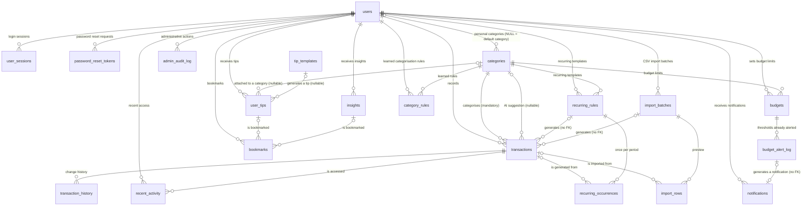
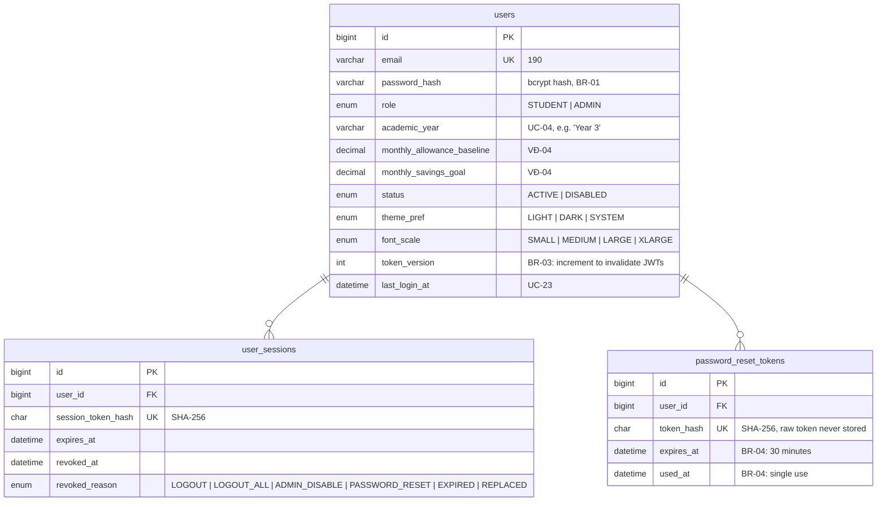
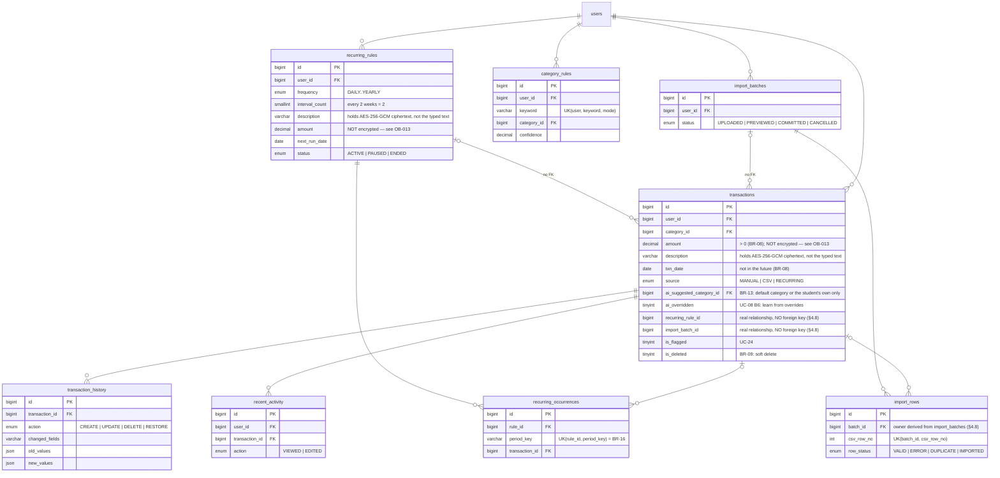
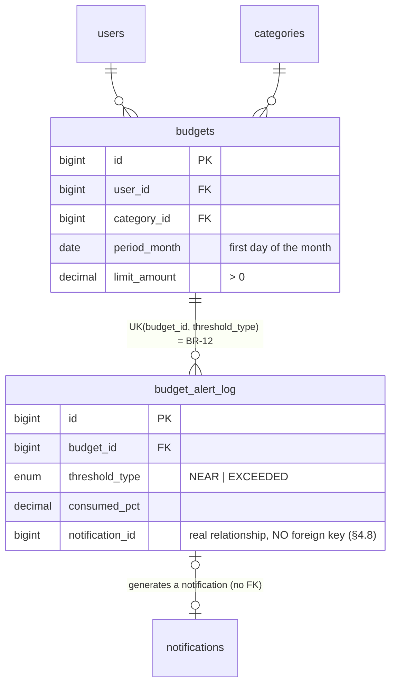
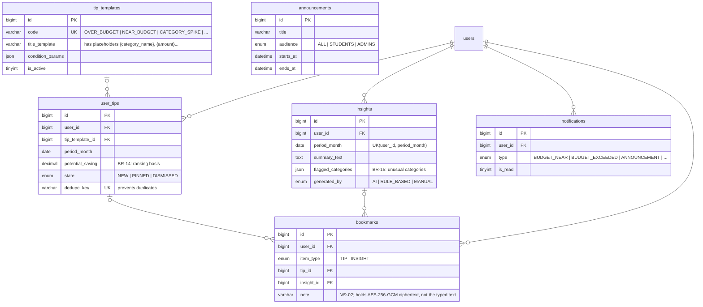
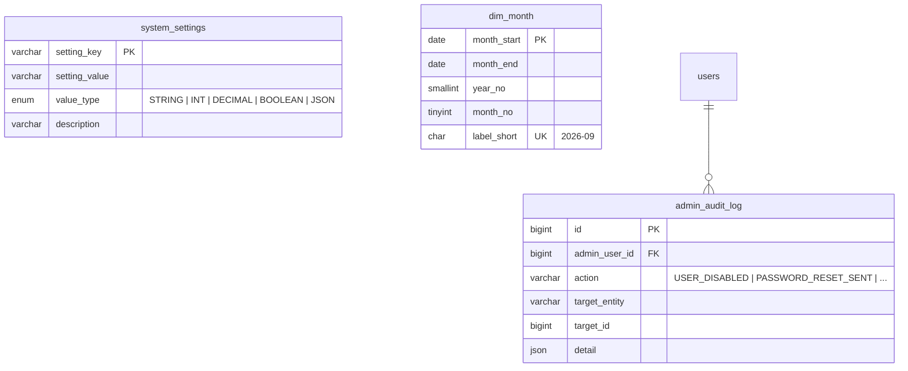

# Entity-relationship diagram — Campus Coin

The database has 23 tables. `01_schema.sql` splits them into **7 groups** in table-creation order; the diagrams below redraw them in **5 sections** for readability (each section merges a few related groups). The 7-group split used by the SQL file, with the full table list, is in [`README.md`](../README.md) §2.2.

> **How to read the diagrams:** the lines below are drawn by **business relationship**, not by foreign key alone. The diagrams therefore **do not** draw every foreign key:
>
> - **Three columns that deliberately have no foreign key are still drawn**, because they express real business relationships: `transactions.recurring_rule_id` (`recurring_rules |o--o{ transactions`), `transactions.import_batch_id` (`import_batches |o--o{ transactions`), `budget_alert_log.notification_id` (`budget_alert_log |o--o| notifications`). The reason no foreign key was added is in [`DB_DESIGN.md`](DB_DESIGN.md) §4.8.
> - **The column `import_rows.ai_suggested_category_id` is not drawn** — this is also a column deliberately without a foreign key, but it is only a temporary value from the preview step and has no guarantee at the SQL layer (see the note in §4.8).
> - **Eight columns have real foreign keys but are not drawn**, so the diagram does not get cluttered. They fall into three groups: (a) audit columns — who created/edited the row: `announcements.created_by`, `system_settings.updated_by`, `tip_templates.created_by`, `transaction_history.changed_by`, `categories.created_by`; (b) redundant columns used for fast queries, already derivable from the parent table: `budget_alert_log.user_id`, `budget_alert_log.category_id`; (c) a column holding the student's choice in the preview step: `import_rows.resolved_category_id`. All of them **do** have real foreign keys, and all appear in the inventory table in [`DB_DESIGN.md`](DB_DESIGN.md) §2.1.
> - **Some relationships are drawn in several group diagrams** (for example `users → budgets` appears both in the budget diagram and in the overview), so the number of lines exceeds the number of foreign keys.
>
> **The full inventory of 38 foreign keys** (generated from `information_schema`, not copied by hand) is in [`DB_DESIGN.md`](DB_DESIGN.md) §2.1.

---

## Overview

---

## Group 1 — Accounts & security

**Why `users` merges both students and administrators:** UC-05 describes two separate sign-in portals, but that is a matter of UI routing. At the data layer, the two user types share the same set of attributes (email, password, status) and take part in the same relationships such as `admin_audit_log`, so splitting the table would only add JOINs without any benefit.

**Why the token hash is stored rather than the token:** if the database leaks, an attacker still cannot use the token to take over an account. The real token exists only in the email sent to the user.

---

## Group 2 — Transactions

> **Why the two lines to `transactions` have the form `|o--o{`:** the foreign keys `fk_occurrence_txn` and `fk_import_row_txn` are **not unique keys**, so technically several `recurring_occurrences` (or `import_rows`) rows can point at the same transaction. In the normal business flow each transaction corresponds to only one row, but the diagram draws exactly the constraint the database actually guarantees. A transaction **need not** have a corresponding row (the `|o` side), because `transaction_id` allows `NULL` — a manually entered transaction has no CSV import row, and a transaction can be soft-deleted while its history row remains.

**Why `transactions` does NOT have a `type` column:** a transaction's type is exactly the type of the category it points at. Keeping a single source of truth (`categories.type`) makes BR-05 — "transaction type must match category type" — **impossible to violate**, rather than merely something detected when someone checks. The `TRANSACTION` sample table in SRS §1.6 also has no such column.

Mandatory consequence: changing the `type` of a category that already has transactions would silently rewrite the whole reporting history (an expense becomes income). `trg_categories_before_update` therefore blocks that operation. The rule "once it has data, the type cannot change" is not in the SRS/Use Cases — it is a **design decision** to protect the correctness of historical data; to genuinely change the type, create a new category and move the transactions over.

**Why two columns above hold ciphertext rather than what was typed:** `transactions.description` and `recurring_rules.description` contain a Base64 AES-256-GCM envelope written by the application, so a direct `SELECT` does not reveal the student's note. `amount` is deliberately **not** encrypted: twelve of the fourteen views read an amount, mostly by joining `v_monthly_income_expense` or `v_category_month_totals`, and MySQL cannot sum ciphertext — see `DB_DESIGN.md` §4.12, `SECURITY.md` §12 and blockers OB-013/OB-014. `bookmarks.note` is the third encrypted column (Group 4). The audit snapshot in `transaction_history` inherits the ciphertext, because the trigger copies the column value.

**Why `recurring_rules` still keeps a `type` column:** a recurring rule is a configuration template and can be set up before any transaction exists, so it needs a place to compare against `categories.type` **at the moment it is created** — `trg_recurring_rules_before_insert/update` does that (UC-09).

**Why `bookmarks` needs an ownership-checking trigger:** a foreign key only guarantees that `tip_id`/`insight_id` points at a row that exists, not who owns that row. Without `trg_bookmarks_before_insert/update`, a student could bookmark — and thereby read — another student's tip or insight, violating BR-02 on data isolation.

**Why a separate `recurring_occurrences` table is needed:** BR-16 requires exactly one transaction per period, even when the scheduler has to catch up on several periods after the system was down. The unique key `(rule_id, period_key)` is what guarantees that at the data layer — the scheduler only needs `INSERT IGNORE` and does not have to check for duplicates itself.

**Why `period_key` is a string rather than a date:** a period can be a day (`2026-09-24`), a week (`2026-W38`), a month (`2026-09`), a quarter (`2026-Q3`) or a year (`2026`) depending on the frequency. A string type can represent all five forms in one column.

**Why `old_values`/`new_values` use JSON:** BR-09 requires change history to be preserved, but the document does not say which columns need to be recorded. With JSON, adding a column to `transactions` later does not require changing the history table.

---

## Group 3 — Budgets

**Why `period_month` is always the first day of the month:** it matches the `Budget` sample table in the SRS (`month DATE` column). A `CHECK (DAYOFMONTH(period_month) = 1)` constraint ensures nobody stores a mid-month date, so month comparisons are always exact without a conversion function.

**Why the `budget_alert_log` table is needed:** BR-12 specifies that each threshold may alert **once** per category per month. The unique key `(budget_id, threshold_type)` is exactly what guarantees that. Thanks to it, UAT-07 meets the requirement: spending 24/30 produces a "near limit" alert, a further 7 taking it to 31/30 produces an "exceeded" alert, and no alert repeats however many times the transaction is edited.

---

## Group 4 — Tips, insights, interactions

**Why there are both `tip_templates` and `user_tips`:** a tip template is content authored by an administrator (UC-21 B3), while a generated tip is a per-student record with its pinned/dismissed state. Splitting the two tables lets the template content be edited later without breaking tips already generated.

**How "pinning" differs from "bookmarking" (VĐ-03):** pinning is `user_tips.state = 'PINNED'` — the tip always shows at the top of the list. Bookmarking is a row in `bookmarks` — saved to view later, with no effect on display order. The document leaves these two concepts open; this design chooses to keep them distinct to avoid confusion.

**Why `dedupe_key` uses a `VIRTUAL` generated column:** a dismissed tip must not be generated again in the same period. A unique key on the generated column guarantees that. It must be `VIRTUAL` rather than `STORED` because MySQL 8 refuses to create a foreign key with `ON DELETE CASCADE` on a table containing a `STORED` generated column.

---

## Group 5 — Configuration & administration

**Why `system_settings` is needed:** VĐ-05, VĐ-08, VĐ-10 and VĐ-12 state clearly that the thresholds (80%, 30%, 3 months), the currency, the time zone, the week calculation and the limit on data sent to the AI service must all be adjustable. Putting them all in one table means an administrator can adjust system behaviour without editing source code or restarting.

**Why `dim_month` is needed:** BR-17 requires the 6-month report to always have all 6 columns, with months that have no data showing 0. A plain `GROUP BY` would omit a completely empty month, so a dimension table is needed to `LEFT JOIN` from.

---

## Documentation → database object cross-check

### Use cases

| Code | Name | Database object |
|---|---|---|
| UC-01 | Account registration | `users` |
| UC-02 | Sign in | `users`, `user_sessions`, `users.token_version` |
| UC-03 | Forgot / reset password | `password_reset_tokens`, `sp_create_password_reset_token`, `sp_verify_password_reset_token`, `sp_complete_password_reset` |
| UC-04 | Manage personal profile | `users` (academic_year, monthly_allowance_baseline, monthly_savings_goal) |
| UC-05 | Sign out / portal authorisation | `users.role`, `user_sessions` |
| UC-06 | Manage categories | `categories`, 3 category triggers |
| UC-07 | Add transaction | `transactions`, `trg_transactions_before_insert` |
| UC-08 | Automatic categorisation with AI | `category_rules`, `transactions.ai_suggested_category_id`, `ai_overridden` |
| UC-09 | Recurring transactions | `recurring_rules`, `recurring_occurrences`, `sp_post_recurring_transactions`, `sp_validate_recurring_rule` |
| UC-10 | Edit / delete transaction | `transactions.is_deleted`, `transaction_history`, `sp_soft_delete_transaction`, `sp_restore_transaction` |
| UC-11 | Import data from CSV | `import_batches`, `import_rows`, `sp_apply_csv_batch` |
| UC-12 | Dashboard | `v_dashboard_summary`, `v_top_category_current_month`, `v_dashboard_tips`, `v_active_announcements` |
| UC-13 | Set budget limits | `budgets`, `v_budget_consumption` |
| UC-14 | Budget alerts | `budget_alert_log`, `notifications`, `sp_check_budget_alerts` |
| UC-15 | Reports by category | `v_monthly_income_expense`, `v_category_month_totals`, `v_daily_spending_current_month`, `v_weekly_spending_current_month` |
| UC-16 | Export reports | Data taken from the report views |
| UC-17 | Monthly analysis with AI | `insights`, `sp_generate_monthly_insight` |
| UC-18 | Saving tips | `tip_templates`, `user_tips`, `sp_generate_tips`, `v_dashboard_tips` |
| UC-19 | Bookmark favourites | `bookmarks`, `trg_bookmarks_before_insert/update` |
| UC-20 | Manage system categories | `categories` with `user_id IS NULL`, `sp_admin_upsert_default_category`, `trg_categories_before_update` |
| UC-21 | Manage announcements & tip templates | `announcements`, `tip_templates`, `sp_admin_create_announcement`, `sp_admin_set_announcement_active`, `sp_admin_upsert_tip_template` |
| UC-22 | Manage users | `sp_set_user_status`, `sp_admin_send_password_reset`, `admin_audit_log` |
| UC-23 | Usage statistics | `v_admin_usage_stats`, `v_admin_top_categories` |
| UC-24 | Detect unusual transactions | `transactions.is_flagged`, `flag_type`, `flag_note` |
| UC-25 | Spending trend alerts | `v_category_spend_trend` |
| UC-26 | Recent activity | `recent_activity`, `sp_touch_recent_activity`, `v_user_recent_activity` |
| UC-27 | Display preferences | `users.theme_pref`, `users.font_scale` |

### Business rules

| Code | Content | Enforcement mechanism |
|---|---|---|
| BR-01 | Store only hashed passwords | `users.password_hash`, no column stores the raw password |
| BR-02 | Data isolation between students | `sp_validate_transaction`, `sp_validate_budget`, `sp_validate_recurring_rule`, `sp_soft_delete_transaction`, `trg_bookmarks_before_insert/update` |
| BR-03 | Disabling an account revokes its sessions | `sp_set_user_status`, `user_sessions.revoked_reason`, `users.token_version` |
| BR-04 | Password reset token is single-use, expires in 30 minutes | `password_reset_tokens.used_at`, `.expires_at`; `sp_complete_password_reset` consumes the token in **one** `UPDATE` with `WHERE used_at IS NULL AND expires_at > NOW()` and then tests `ROW_COUNT()` (§4.10) |
| BR-05 | Transaction type must match category type | `transactions` has no `type` column — the type comes from `categories.type`, so it cannot drift. Recurring rules are checked by `sp_validate_recurring_rule` |
| BR-06 | Default categories can only be edited by an administrator | `sp_require_admin` (the common gate for every administrative action), `sp_admin_upsert_default_category`, `trg_categories_before_insert` (requires `created_by` to be an active administrator). A direct write through hand-written SQL is not blocked — see `DB_DESIGN.md` §4.4 |
| BR-07 | A category still in use cannot be hard-deleted | Three `ON DELETE RESTRICT` foreign keys are the main guard: `fk_txn_category` (transactions remain), `fk_budget_category` (budgets remain), `fk_recurring_category` (recurring rules remain). `trg_categories_before_delete` additionally covers the budget case to report a clear error instead of a raw foreign-key error |
| BR-08 | Amount positive, date not in the future | `ck_txn_amount`, `sp_validate_transaction` |
| BR-09 | Soft delete, history preserved | `transactions.is_deleted`, `transaction_history`, `trg_transactions_before_delete` |
| BR-10 | Income/expense difference = total income − total expense | `v_monthly_income_expense.net_amount` |
| BR-11 | One budget limit per (student, expense category, month) | `uk_budget_user_cat_month`, `sp_validate_budget` |
| BR-12 | Alert once per threshold per month | `uk_alert_budget_threshold`, `sp_check_budget_alerts` |
| BR-13 | AI output is advisory only | Three columns separate the **suggestion** from the **decision**: `transactions.ai_suggested_category_id` (the suggestion), `category_id` (the student's choice), `ai_overridden` (whether the student overrode it). `sp_validate_transaction` blocks a suggestion pointing at another student's category; `insights.generated_by` distinguishes `AI` / `RULE_BASED` |
| BR-14 | Show tips by potential saving | `user_tips.potential_saving`, `rank_score`, `v_dashboard_tips` |
| BR-15 | Flag a category up ≥ 30% versus the 3-month average | `v_category_spend_trend.is_spike` (the average divides by all 3 months, an empty month counts as 0) |
| BR-16 | Each recurring period generates one transaction only | `uk_occurrence_rule_period` |
| BR-17 | 6-month report, empty months are 0 | `dim_month`, `v_monthly_income_expense_6m` |
| BR-18 | Export a file only when the user asks | No buffer table — the file is generated at call time |
| VĐ-05 | Configurable thresholds | `system_settings` |
| VĐ-08 | A single currency | `system_settings` key `app.currency` |
| VĐ-10 | Week starts on Monday, fixed time zone | `system_settings` keys `app.week_start`, `app.timezone` |
| VĐ-12 | Send only aggregate figures to the AI service | `system_settings` key `ai.send_aggregates_only` |

### Verified acceptance tests

| Code | Content | Result |
|---|---|---|
| UAT-06 | Edit then delete a transaction → a log exists, the transaction does not count toward the balance | ✅ The log records `CREATE` → `UPDATE` → `DELETE`; total spending drops accordingly |
| UAT-07 | Budget 30, spend 24 then 7 → exactly one "near limit" and one "exceeded" | ✅ Verified directly on MySQL |
| UAT-09 | 6-month report, months with no data show 0 | ✅ All 6 rows present, empty months are 0 |
